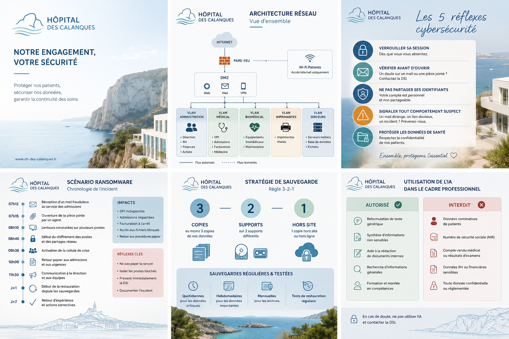
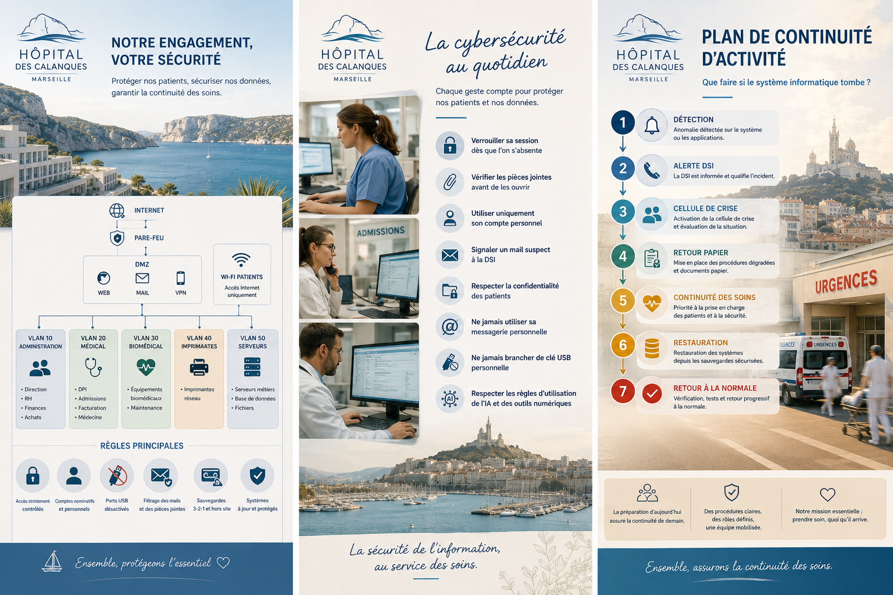

# Programme Cybersecurite du Centre Hospitalier des Calanques

Ce depot presente un programme GRC / RSSI junior construit autour d'un etablissement de sante fictif : le Centre Hospitalier des Calanques.

Le projet est entierement fictif. Il ne contient aucune donnee reelle, aucun nom d'etablissement reel, aucun secret technique et aucune information patient.

## Objectif Portfolio

L'objectif est de demontrer une capacite a structurer un programme cyber adapte a un hopital francais de taille moyenne, avec des politiques, procedures, registres et modeles directement exploitables dans une demarche GRC.

Le depot illustre notamment :

- la formalisation de politiques de securite ;
- l'organisation d'une fonction RSSI ;
- la gestion des risques cyber ;
- la gestion des habilitations et comptes privilegies ;
- la securisation des postes, serveurs, sauvegardes, messagerie et acces web ;
- la continuite d'activite en contexte hospitalier ;
- la sensibilisation des agents ;
- l'encadrement de l'utilisation de l'IA ;
- la gestion d'une crise ransomware.

## Contexte Fictif

Le Centre Hospitalier des Calanques est un hopital francais fictif de taille moyenne.

Hypotheses retenues :

- 420 lits ;
- 1 200 agents ;
- services : urgences, SMUR, maternite, bloc operatoire, imagerie, laboratoire, admissions, facturation, RH et direction ;
- systeme d'information : Active Directory, Microsoft 365, DPI, PACS imagerie, serveurs VMware, pare-feu, Wi-Fi patients, imprimantes reseau et sauvegardes.

## Supports visuels

Ces deux visuels institutionnels fictifs illustrent l'identite du Centre Hospitalier des Calanques : ambiance Mediterranee, Marseille et les Calanques, couleurs douces beige, creme et bleu, style hospitalier moderne et logo fictif Hopital des Calanques.

Ils servent de supports de presentation pour expliquer la gouvernance cyber, la sensibilisation du personnel, la continuite d'activite et la protection des donnees de sante.

### Galerie d'aperçu

| Architecture et gouvernance cybersécurité du Centre Hospitalier des Calanques | La cybersécurité au quotidien et le plan de continuité d'activité du Centre Hospitalier des Calanques |
|---|---|
|  |  |

## Arborescence

```text
assets/images/
01_Gouvernance/
02_Gestion_des_Risques/
03_Gestion_des_Acces/
04_Postes_de_Travail/
05_Messagerie_et_Web/
06_Serveurs_et_Sauvegardes/
07_Continuite_Activite/
08_Sensibilisation/
09_IA_et_Sante/
10_Crise_Ransomware/
diagrams/
templates/
```

## Documents Principaux

- `01_Gouvernance/` : politique cyber, charte utilisateur, organisation RSSI, comite cyber.
- `02_Gestion_des_Risques/` : registre des risques, matrice d'evaluation, plan de traitement.
- `03_Gestion_des_Acces/` : mots de passe, comptes privilegies, habilitations, arrivees et departs.
- `04_Postes_de_Travail/` : securisation des postes, droits utilisateurs, cles USB, sessions oubliees.
- `05_Messagerie_et_Web/` : messagerie, navigation Internet, pieces jointes, filtrage web.
- `06_Serveurs_et_Sauvegardes/` : serveurs, sauvegardes, Windows, Active Directory, Microsoft 365.
- `07_Continuite_Activite/` : PCA urgences, pannes postes et serveurs, retour papier.
- `08_Sensibilisation/` : programme annuel, phishing, donnees sensibles, campagnes.
- `09_IA_et_Sante/` : politique IA, cas autorises, cas interdits, risques IA.
- `10_Crise_Ransomware/` : scenario, cellule de crise, procedure, rapport, retour d'experience.
- `assets/images/` : visuels institutionnels fictifs du Centre Hospitalier des Calanques.
- `diagrams/` : architecture reseau et segmentation VLAN.
- `templates/` : fiches et formulaires reutilisables.

## Competences Demontrees

- Analyse de risques cyber en environnement de sante.
- Redaction de politiques et procedures RSSI.
- Definition de controles GRC et d'indicateurs.
- Gestion des identites, acces et comptes privilegies.
- Segmentation reseau et principes de defense en profondeur.
- Preparation a la crise et continuite d'activite.
- Communication cyber adaptee a des publics non techniques.
- Encadrement de l'IA et protection des donnees sensibles.

## Limites du Projet

Ce projet est volontairement documentaire et pedagogique. Il ne remplace pas un audit, une homologation, une analyse juridique ou une mission realisee dans un etablissement reel.

Les mesures proposees sont des exemples coherents pour un portfolio RSSI / GRC junior et doivent etre adaptees avant toute utilisation operationnelle.

## Mention de Fiction

Le Centre Hospitalier des Calanques est un etablissement fictif. Toutes les situations, procedures, risques, architectures et incidents decrits sont inventes pour illustrer une demarche cyber professionnelle.
