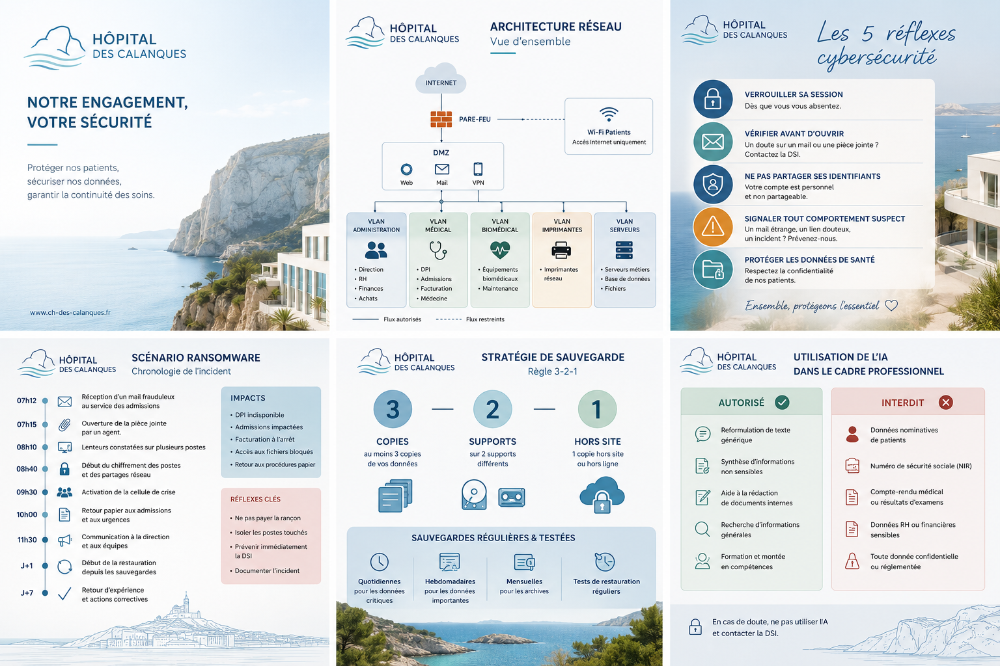
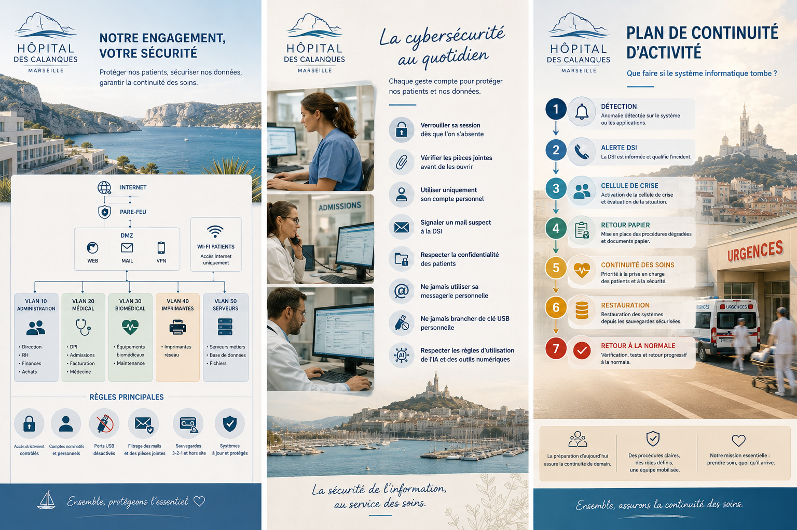

# Programme cybersécurité du Centre Hospitalier des Calanques

Ce dépôt présente un programme GRC / RSSI junior construit autour d'un établissement de santé fictif : le Centre Hospitalier des Calanques.

Le projet est entièrement fictif. Il ne contient aucune donnée réelle, aucun nom d'établissement réel, aucun secret technique et aucune information patient.

## Objectif du portfolio

L'objectif est de démontrer une capacité à structurer une démarche cybersécurité adaptée à un hôpital français de taille moyenne : gouvernance, gestion des risques, accès, continuité d'activité, sensibilisation, conformité, IA et gestion de crise.

Ce dépôt ne prétend pas représenter un SMSI certifié ni une mission RSSI réellement conduite dans un établissement. Il s'agit d'un environnement pédagogique permettant de transformer des connaissances théoriques en politiques, procédures, registres, scénarios et décisions de pilotage cohérents.

## Contexte fictif

Le Centre Hospitalier des Calanques est un hôpital français fictif de taille moyenne.

Hypothèses retenues :

- 420 lits ;
- 1 200 agents ;
- services : urgences, SMUR, maternité, bloc opératoire, imagerie, laboratoire, admissions, facturation, RH et direction ;
- système d'information : Active Directory, Microsoft 365, DPI, PACS imagerie, serveurs VMware, pare-feu, Wi-Fi patients, imprimantes réseau et sauvegardes.

## Démarche suivie

Le projet suit une logique simple :

1. comprendre les activités critiques et les dépendances numériques ;
2. identifier et prioriser les risques ;
3. définir une gouvernance et des responsabilités ;
4. formaliser les contrôles et procédures ;
5. préparer la continuité et la gestion de crise ;
6. mesurer l'efficacité des actions ;
7. organiser l'amélioration continue.

La feuille de route `00_Pilotage/Feuille_De_Route_RSSI.md` expose les priorités proposées à 30, 90 et 180 jours ainsi que leur justification.

## Supports visuels

Ces visuels institutionnels fictifs illustrent l'identité du Centre Hospitalier des Calanques et servent de supports de présentation de la gouvernance, de la sensibilisation et de la continuité d'activité.

### Galerie d'aperçu

| Architecture et gouvernance cybersécurité | Cybersécurité au quotidien et continuité d'activité |
|---|---|
|  |  |

## Arborescence principale

```text
00_Pilotage/
01_Gouvernance/
02_Gestion_des_Risques/
03_Gestion_des_Acces/
04_Postes_de_Travail/
05_Messagerie_et_Web/
06_Serveurs_et_Sauvegardes/
07_Continuite_Activite/
08_Sensibilisation/
09_IA_et_Sante/
10_Crise_Ransomware/
11_Conformite/
13_Audit/
assets/images/
diagrams/
templates/
```

> La numérotation reflète l'évolution progressive du portfolio. L'absence d'un dossier `12_` n'a pas de signification fonctionnelle.

## Documents principaux

- `00_Pilotage/` : feuille de route RSSI 30 / 90 / 180 jours et logique de priorisation.
- `01_Gouvernance/` : politique cybersécurité, charte utilisateur, organisation RSSI, comité cyber.
- `02_Gestion_des_Risques/` : registre des risques, matrice d'évaluation, plan de traitement et analyse de risques simplifiée inspirée d'EBIOS Risk Manager.
- `03_Gestion_des_Acces/` : mots de passe, comptes privilégiés, habilitations, arrivées et départs.
- `04_Postes_de_Travail/` : sécurisation des postes, droits utilisateurs, clés USB, sessions oubliées.
- `05_Messagerie_et_Web/` : messagerie, navigation Internet, pièces jointes, filtrage web.
- `06_Serveurs_et_Sauvegardes/` : serveurs, sauvegardes, Windows, Active Directory, Microsoft 365.
- `07_Continuite_Activite/` : PCA urgences, fonctionnement dégradé, pannes postes et serveurs, retour papier.
- `08_Sensibilisation/` : programme annuel, phishing, données sensibles, campagnes.
- `09_IA_et_Sante/` : politique IA, cas autorisés/interdits et registre des risques IA.
- `10_Crise_Ransomware/` : scénario, chronologie, cellule de crise, procédure, rapport et retour d'expérience.
- `11_Conformite/` : exemples de gouvernance RGPD et conformité appliqués au contexte fictif.
- `13_Audit/` : plan d'audit interne cybersécurité dans une logique de préparation SMSI.
- `diagrams/` : architecture réseau et segmentation VLAN.
- `templates/` : fiches et formulaires réutilisables.

## Points démontrés

### Gouvernance et GRC

- organisation de la fonction RSSI ;
- définition de responsabilités Direction / DSI / RSSI / DPO / métiers ;
- registre des risques avec score brut, stratégie de traitement et cible résiduelle ;
- plan de traitement avec responsables, échéances, indicateurs et statut ;
- pilotage par indicateurs et comité cyber.

### Sécurité opérationnelle

- gestion des identités, habilitations et comptes privilégiés ;
- durcissement des postes et serveurs ;
- segmentation réseau et défense en profondeur ;
- sauvegardes et tests de restauration ;
- sensibilisation au phishing et aux données sensibles.

### Résilience hospitalière

- continuité d'activité des services critiques ;
- fonctionnement dégradé et retour papier ;
- préparation et gestion d'une crise ransomware ;
- retour d'expérience et plan d'amélioration.

### Données et nouveaux usages

- protection des données personnelles et de santé ;
- encadrement des usages d'intelligence artificielle ;
- articulation RSSI / DPO ;
- réflexion sur les sous-traitants et services externalisés.

## Analyse de risques

Le dépôt contient une **analyse de risques simplifiée inspirée d'EBIOS Risk Manager**.

Elle identifie des biens essentiels, biens supports, événements redoutés, sources de risque, scénarios et mesures de traitement. Elle est volontairement qualifiée de simplifiée : elle ne constitue pas une étude EBIOS Risk Manager exhaustive selon l'ensemble des ateliers de la méthode.

## Positionnement ISO/IEC 27001

ISO/IEC 27001 et ISO/IEC 27002 sont utilisées comme références de structuration et de bonnes pratiques.

Le projet ne revendique ni certification ni mise en place complète d'un SMSI. Le plan d'audit est présenté comme un exercice de **préparation à une démarche SMSI**. Une démarche ISO/IEC 27001 réelle nécessiterait notamment un périmètre formel, l'analyse du contexte et des parties intéressées, des objectifs mesurables, une déclaration d'applicabilité, des revues de direction et un cycle d'amélioration documenté.

## Compétences illustrées

- analyse et traitement des risques cyber en environnement de santé ;
- rédaction de politiques et procédures RSSI ;
- définition de contrôles GRC et d'indicateurs ;
- gestion des identités, accès et comptes privilégiés ;
- continuité d'activité et préparation à la crise ;
- communication cyber adaptée à des publics non techniques ;
- encadrement de l'IA et protection des données sensibles ;
- préparation d'un audit interne cybersécurité.

## Limites du projet

Ce projet est documentaire et pédagogique. Il ne remplace pas :

- un audit réalisé sur un système d'information réel ;
- une homologation ;
- une analyse juridique ;
- une étude EBIOS Risk Manager complète ;
- une certification ISO/IEC 27001 ;
- une mission RSSI menée avec les équipes d'un établissement.

Les mesures proposées doivent être adaptées au contexte, aux contraintes de soins, aux architectures, aux risques, aux obligations applicables et aux capacités réelles de l'organisation.

## Mention de fiction

Le Centre Hospitalier des Calanques est un établissement fictif. Toutes les situations, procédures, risques, architectures et incidents décrits sont inventés pour illustrer une démarche cyber professionnelle.
