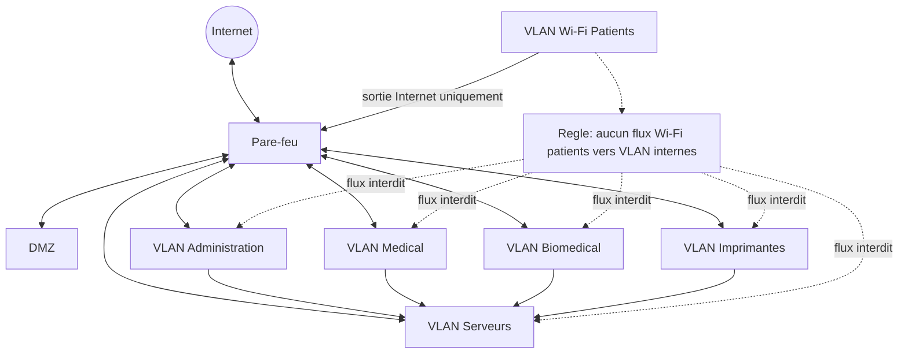

# Architecture Reseau

## Objectif

Representer de maniere simplifiee l'architecture reseau cible du Centre Hospitalier des Calanques.

## Diagramme Mermaid

## Principes

- Le pare-feu controle les flux entre Internet, DMZ et VLAN internes.
- La DMZ heberge uniquement les services devant etre exposes ou accessibles depuis l'exterieur.
- Le VLAN Medical accede uniquement aux services necessaires : DPI, PACS, laboratoire et impression autorisee.
- Le VLAN Biomedical est limite aux flux requis par les equipements medicaux.
- Le VLAN Imprimantes est cloisonne et ne doit pas initier de flux non necessaires.
- Le VLAN Serveurs concentre les services critiques et fait l'objet d'une supervision renforcee.
- Le Wi-Fi patients est strictement isole et ne sort que vers Internet.
